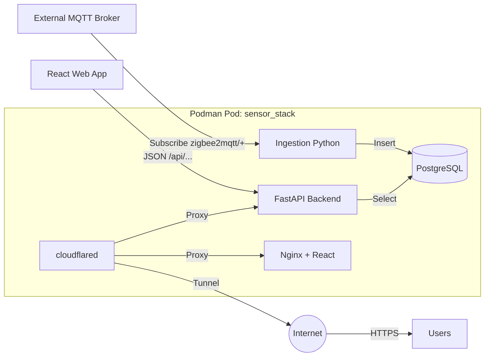

# 🗺️ Project Roadmap: MQTT Sensor Dashboard (React Edition)

This document outlines the development roadmap for the **MQTT Sensor Dashboard**, a containerized application that connects to an **external MQTT broker**, discovers Zigbee2MQTT topics, stores data in PostgreSQL, and visualizes it via a modern React UI.

---

## 🚀 Project Overview

**Goal:** Create a bespoke, containerized pipeline to monitor home automation sensors.

**Tech Stack:**

| Layer          | Technology                          |
|----------------|-------------------------------------|
| Infrastructure | Podman (Pods & Containers)          |
| Ingestion      | Python (Paho-MQTT)                  |
| Database       | PostgreSQL (Time-series data)       |
| Migrations     | Alembic (Python)                    |
| API Backend    | FastAPI (Python) or Express (Node.js) |
| Real-time      | WebSockets (FastAPI / Socket.io)    |
| Frontend       | React (Vite) + Tailwind CSS + Recharts |
| Authentication | Google OAuth 2.0                    |
| Email Reports  | Resend (Daily Summaries)            |
| Tunnel/Proxy   | Cloudflare Tunnel (cloudflared)     |
| Testing        | Pytest + React Testing Library + Playwright |
| CI/CD          | GitHub Actions                      |
| Monitoring     | Health Checks + Structured Logging  |
| Versioning     | Semantic Versioning + Git Tags      |
| Deployment     | Shell Scripts + Podman Compose      |

---

## 📅 Roadmap Stages

### Phase 1: Infrastructure Setup (Podman) ✅

> Establish the containerized environment to ensure portable execution.

- [x] **Define Podman Pod**
  - Create a pod named `sensor_stack` to group the Database, API, and Ingester.
  - **Note:** The pod does *not* need to expose MQTT ports, only the Web UI port (e.g., 80 or 3000).

- [x] **PostgreSQL Container**
  - Deploy official PostgreSQL image.
  - Configure persistent volume for `pg_data`.

- [x] **Environment Configuration**
  - Create a `.env` file to store external broker credentials:
    - `MQTT_BROKER_IP`
    - `MQTT_PORT`
    - `MQTT_USER` / `MQTT_PASS`

- [x] **Orchestration**
  - Create a `podman-compose.yml` defining services for: Database, Ingester, API, Frontend, and Cloudflared.
  - Create a `podman-compose.dev.yml` override for local development:
    | Difference         | Production              | Development             |
    |--------------------|-------------------------|-------------------------|
    | Hot Reload         | Disabled                | Enabled (volume mounts) |
    | Cloudflared        | Enabled                 | Disabled                |
    | Port Exposure      | Internal only           | Exposed to localhost    |
    | Debug Mode         | Off                     | On (verbose logging)    |
    | Database           | Persistent volume       | Persistent volume       |

- [x] **Local Development Setup**
  - Mount source code as volumes for hot-reload:
    - `./api:/app` for FastAPI (with `--reload` flag)
    - `./frontend:/app` for React (Vite dev server)
    - `./ingester:/app` for Python ingester
  - Expose ports locally:
    | Service    | Local Port | Purpose                    |
    |------------|------------|----------------------------|
    | Frontend   | 3000       | Vite dev server            |
    | API        | 8000       | FastAPI with auto-reload   |
    | PostgreSQL | 5432       | Direct DB access for tools |
  - Create `scripts/dev.sh` to start development environment:
    ```bash
    podman-compose -f podman-compose.yml -f podman-compose.dev.yml up
    ```
  - Support connecting to **either** external MQTT broker or local test broker.

- [x] **Health Checks & Monitoring**
  - Add health check endpoints to each service:
    | Service    | Endpoint           | Checks                          |
    |------------|--------------------|---------------------------------|
    | API        | `GET /health`      | DB connection, memory, uptime   |
    | Ingester   | `GET /health`      | MQTT connection, last message   |
    | PostgreSQL | TCP check          | Port 5432 responsive            |
  - Configure Podman health checks in compose file.
  - Implement structured JSON logging (timestamp, level, service, message).
  - Add log aggregation strategy (stdout → file rotation or external service).

- [x] **Cloudflare Tunnel (cloudflared)**
  - Deploy `cloudflare/cloudflared` container in the pod.
  - Configure tunnel to expose the web UI securely without port forwarding.
  - Set up tunnel routes:
    | Route                     | Target Service        |
    |---------------------------|-----------------------|
    | `sensors.yourdomain.com`  | Frontend (Nginx)      |
    | `api.sensors.yourdomain.com` | API (FastAPI)      |
  - Store tunnel credentials:
    - `CLOUDFLARE_TUNNEL_TOKEN` in `.env`
    - Or mount `credentials.json` file as volume.
  - Benefits:
    - No need to open firewall ports.
    - Built-in DDoS protection.
    - Automatic HTTPS certificates.

- [x] **Version Tracking**
  - Create `VERSION` file in project root (e.g., `1.0.0`).
  - Follow [Semantic Versioning](https://semver.org/): `MAJOR.MINOR.PATCH`
  - Inject version into containers via build args or environment variables.
  - Display version in:
    - API: `GET /api/version` endpoint
    - Frontend: Footer or settings page
  - Tag Git releases to match version (e.g., `git tag v1.0.0`).

---

### Phase 2: Database Schema Design ✅

> Design a schema robust enough for variable Zigbee payloads.

- [x] **Schema Definition**
  - Create table `sensor_readings`:
    | Column        | Type      | Notes       |
    |---------------|-----------|-------------|
    | `time`        | TIMESTAMP | Primary Key |
    | `topic`       | TEXT      | Indexed     |
    | `temperature` | FLOAT     |             |
    | `humidity`    | FLOAT     |             |
    | `battery`     | INT       |             |
    | `linkquality` | INT       |             |
    | `raw_data`    | JSONB     |             |

  - Create table `users` (for authentication):
    | Column             | Type      | Notes                    |
    |--------------------|-----------|--------------------------||
    | `id`               | UUID      | Primary Key              |
    | `email`            | TEXT      | Unique, from Google      |
    | `name`             | TEXT      | Display name             |
    | `picture`          | TEXT      | Avatar URL               |
    | `is_allowed`       | BOOLEAN   | Whitelist flag           |
    | `daily_report`     | BOOLEAN   | Receive daily reports    |
    | `report_time`      | TIME      | Preferred delivery time  |
    | `created_at`       | TIMESTAMP | Account creation time    |

- [x] **Optimization**
  - Create indexes on `topic` and `time` for fast graph rendering.
  - Create a view `latest_readings` to fetch the single most recent row per device.

- [x] **Database Migrations (Alembic)**
  - Initialize Alembic in the API project.
  - Create initial migration for `sensor_readings` and `users` tables.
  - Add migration scripts to deployment process.
  - Document rollback procedures.

---

### Phase 3: Backend Ingestion Service ✅

> The bridge that connects your external broker to the internal database.

- [x] **External Connection**
  - Implement Python script using `paho-mqtt`.
  - Configure connection logic to reach the **External Broker IP**.
  - Subscribe to `zigbee2mqtt/+` (wildcard).

- [x] **Payload Parsing**
  - **Type A (Full):** Extract `comfort_` metrics, `update` status.
  - **Type B (Minimal):** Extract `temp/battery` only.
  - Flatten the JSON structure for SQL insertion.

- [x] **Data Persistence**
  - Write cleaned data to PostgreSQL `sensor_readings` table.

---

### Phase 4: REST API Layer ✅

> React cannot talk to Postgres directly; this layer serves the data.

- [x] **Setup API Framework**
  - Initialize a lightweight API (e.g., Python FastAPI).

- [x] **API Documentation (Auto-generated)**
  - Enable FastAPI's built-in Swagger UI at `/docs`.
  - Enable ReDoc at `/redoc`.
  - Add detailed docstrings and Pydantic models for auto-documentation.
  - Export OpenAPI schema for external tools.

- [x] **Security Hardening**
  - Implement rate limiting (e.g., 100 requests/minute per user).
  - Configure CORS (allow only your frontend domain).
  - Add input validation on all endpoints (Pydantic).
  - Sanitize database queries (use ORM/parameterized queries).
  - Add request logging with user context.

- [x] **Develop Endpoints**
  | Endpoint                    | Description                                      |
  |-----------------------------|--------------------------------------------------|
  | `GET /api/devices`          | Returns distinct list of discovered topics/sensors |
  | `GET /api/latest`           | Returns the most recent reading for all devices (for Cards) |
  | `GET /api/history/{device_id}` | Returns data points for the last 24h/7d (for Graphs) |

- [x] **WebSocket Support (Real-time Updates)**
  - Implement WebSocket endpoint: `WS /ws/sensors`
  - Broadcast new sensor readings in real-time as they arrive.
  - Benefits over polling:
    - Instant updates (no 30-60 second delay).
    - Lower server load (no repeated HTTP requests).
    - Better UX for live monitoring.
  - Fallback to polling for clients that don't support WebSockets.

- [x] **Containerize API**
  - Create `Dockerfile.api` and add to the pod.

- [x] **Google Authentication (Backend)**
  - Set up Google Cloud Console project and OAuth 2.0 credentials.
  - Implement OAuth 2.0 flow endpoints:
    | Endpoint              | Description                              |
    |-----------------------|------------------------------------------|
    | `GET /auth/login`     | Redirects to Google OAuth consent screen |
    | `GET /auth/callback`  | Handles OAuth callback and issues JWT    |
    | `GET /auth/me`        | Returns current authenticated user info  |
    | `POST /auth/logout`   | Invalidates session/token                |
  - Store allowed users in a `users` table or whitelist.
  - Protect `/api/*` endpoints with JWT middleware.
  - Add environment variables:
    - `GOOGLE_CLIENT_ID`
    - `GOOGLE_CLIENT_SECRET`
    - `JWT_SECRET`

- [x] **Daily Email Reports (Resend)**
  - Set up [Resend](https://resend.com) account and obtain API key.
  - Create report service endpoints:
    | Endpoint                     | Description                              |
    |------------------------------|------------------------------------------|
    | `GET /api/report/preview`    | Preview today's report (HTML)            |
    | `POST /api/report/send-now`  | Manually trigger report for current user |
    | `PUT /api/user/preferences`  | Update report preferences                |
  - Implement scheduled report job:
    - Run daily at user's preferred time (default: 8:00 AM).
    - Use `pg_cron` or Python scheduler (APScheduler).
  - Report content:
    - 24-hour summary for each sensor (min/max/avg temp & humidity).
    - Battery status alerts (< 20%).
    - Sensor offline warnings (no data in last 2 hours).
    - Mini sparkline charts (optional, as inline images).
  - Add environment variables:
    - `RESEND_API_KEY`
    - `REPORT_FROM_EMAIL` (e.g., `sensors@yourdomain.com`)

---

### Phase 5: React Frontend (The "Pretty" UI) ✅

> Building the visual interface.

- [x] **Project Setup**
  - Initialize with **Vite** for speed.
  - Install **Tailwind CSS** for styling.
  - Install **Recharts** or **Nivo** for beautiful, responsive charts.

- [x] **Component Development**
  - **Sensor Card:** A glass-morphism style card showing current Temp, Humidity, and Battery icon.
  - **Chart Component:** A smooth spline area chart showing temperature history.
  - **Layout:** A responsive grid that adjusts columns based on screen size.

- [x] **State Management**
  - Implement React Query (TanStack Query) to poll the API every 30-60 seconds.
  - Add WebSocket connection for real-time updates:
    - Auto-reconnect on disconnect.
    - Merge live updates with cached query data.
    - Show connection status indicator (🟢 Live / 🟡 Reconnecting / 🔴 Offline).

- [x] **Google Authentication (Frontend)**
  - Create **Login Page** with "Sign in with Google" button.
  - Implement protected routes (redirect to login if not authenticated).
  - Store JWT token in `httpOnly` cookie or secure storage.
  - Add user avatar/logout button in the header.
  - Handle token expiration and refresh.

- [x] **Report Preferences UI**
  - Add **Settings Page** with:
    - Toggle for daily email reports (on/off).
    - Time picker for preferred delivery time.
    - "Send Test Report" button.
    - Preview of report format.

- [x] **Containerize Frontend**
  - Create multi-stage `Dockerfile.web`:
    1. **Build:** Node.js compiles React to static HTML/JS.
    2. **Serve:** Nginx (Alpine) serves the static files.

---

### Phase 6: Polish & Optimization ✅

- [x] **UI Polish**
  - Add Dark Mode support.
  - Add color-coding (e.g., temperature turns red if > 25°C).

- [x] **Mobile Responsiveness**
  - Ensure graphs scale down correctly on phones.

- [x] **Data Cleanup**
  - Implement a scheduled job (`pg_cron`) to remove raw data older than 30 days.

---

### Phase 7: Testing ✅

> Ensure reliability and catch regressions early.

- [x] **Backend Testing (Pytest)**
  - Unit tests for:
    - Payload parsing logic (17 tests).
    - Database models and queries (13 service tests).
    - Authentication flow (6 tests).
    - Schema validation (14 tests).
    - Rate limiter middleware (6 tests).
    - WebSocket manager (10 tests).
  - Integration tests for:
    - API endpoints with test database (18 route tests).
  - Test coverage target: **80%+**

- [x] **Frontend Testing**
  - Unit tests with **React Testing Library**:
    - Type helper functions (22 tests).
    - SensorCard component rendering & interactions (14 tests).
    - TemperatureChart rendering & empty state (4 tests).
    - useDarkMode hook state management (8 tests).
  - E2E tests with **Playwright**:
    - Dashboard navigation.
    - Auth flow checks.
    - Dark mode toggle.

- [x] **Test Infrastructure**
  - Created `podman-compose.test.yml` for isolated test environment.
  - SQLite test database with seed data fixtures (no Postgres required).
  - Created `scripts/test.sh` and `scripts/lint.sh`.

---

### Phase 8: CI/CD & Deployment Scripts

> Automate testing, building, and deployment for consistent releases.

- [ ] **GitHub Actions CI/CD Pipeline**
  - Create `.github/workflows/ci.yml`:
    | Trigger       | Actions                                    |
    |---------------|--------------------------------------------|
    | Push to `main`| Lint → Test → Build → Deploy (if tests pass) |
    | Pull Request  | Lint → Test → Build (no deploy)           |
    | Tag `v*`      | Build → Push images → Create release       |
  - Pipeline steps:
    1. **Lint:** Run `ruff` (Python) + `eslint` (React).
    2. **Test:** Run Pytest + React tests in containers.
    3. **Build:** Build all container images.
    4. **Push:** Push images to container registry (GitHub Container Registry).
    5. **Deploy:** SSH to server and run `deploy.sh` (optional).
  - Add status badges to `README.md`.

- [ ] **Deployment Scripts**
  - Create `scripts/` directory with:
    | Script            | Purpose                                           |
    |-------------------|---------------------------------------------------|
    | `dev.sh`          | Start local development environment (hot-reload) |
    | `test.sh`         | Run all tests in containerized environment        |
    | `lint.sh`         | Run linters (ruff + eslint)                       |
    | `deploy.sh`       | Full deployment (build + start all services)      |
    | `build.sh`        | Build all container images                        |
    | `start.sh`        | Start the pod and all containers                  |
    | `stop.sh`         | Gracefully stop all services                      |
    | `restart.sh`      | Stop + Start (for quick restarts)                 |
    | `logs.sh`         | Tail logs from all containers                     |
    | `backup-db.sh`    | Backup PostgreSQL database to file                |
    | `restore-db.sh`   | Restore database from backup                      |
    | `migrate.sh`      | Run database migrations (Alembic)                 |
    | `bump-version.sh` | Increment version and tag release                 |
    | `tunnel-status.sh`| Check cloudflared tunnel connection status        |

- [ ] **Deploy Script Features (`deploy.sh`)**
  ```bash
  #!/bin/bash
  # Usage: ./deploy.sh [--build] [--migrate]
  ```
  - Read version from `VERSION` file.
  - Check for required environment variables.
  - Optionally rebuild images with `--build` flag.
  - Run database migrations with `--migrate` flag.
  - Pull latest images or build locally.
  - Restart pod with zero-downtime strategy.
  - Print deployment summary with version info.

- [ ] **Version Bump Script (`bump-version.sh`)**
  ```bash
  # Usage: ./bump-version.sh [major|minor|patch]
  ```
  - Increment the appropriate version segment.
  - Update `VERSION` file.
  - Create git commit and tag.
  - Optionally push to remote.

- [ ] **Quick Start Documentation**
  - Create `DEPLOYMENT.md` with:
    - Prerequisites (Podman, environment setup)
    - First-time setup instructions
    - Common commands cheat sheet
    - Troubleshooting guide
  - Create comprehensive `README.md` with:
    - Project overview and screenshots.
    - Quick start (3 commands to run locally).
    - Architecture overview.
    - API documentation link.
    - Contributing guidelines.

---

## 🛠️ Architecture Diagram



---

## 📝 Payload Handling Strategy

The React frontend will **not** handle raw MQTT JSON. The Ingestion Service will normalize these two formats into a standard database row so the API serves consistent JSON to the frontend.

### Incoming Format (Variable)

```json
// Type A - Full payload (with humidity)
{"battery": 100, "humidity": 61, "humidity_calibration": 0, "linkquality": 104, "temperature": 17, "temperature_calibration": 0, "temperature_units": "celsius", "voltage": 2900}

// Type B - Minimal payload (temperature only, no humidity)
{"battery": 100, "linkquality": 156, "temperature": 6.2, "temperature_calibration": 0, "temperature_units": "celsius"}
```

### API Response to React (Standardized)

```json
[
  {
    "device": "Office Sensor",
    "temp": 18.1,
    "humidity": 56.1,
    "battery": 100,
    "last_seen": "2023-10-27T10:00:00Z"
  },
  {
    "device": "Fridge Sensor",
    "temp": 6.2,
    "humidity": null,
    "battery": null,
    "last_seen": "2023-10-27T09:58:00Z"
  }
]
```

---

## 📊 Progress Tracker

| Phase | Status | Description |
|-------|--------|-------------|
| 1     | ✅ Complete | Infrastructure Setup |
| 2     | ✅ Complete | Database Schema |
| 3     | ✅ Complete | Ingestion Service |
| 4     | ✅ Complete | REST API |
| 5     | ✅ Complete | React Frontend |
| 6     | ✅ Complete | Polish & Optimization |
| 7     | ✅ Complete | Testing |
| 8     | ⬜ Not Started | CI/CD & Deployment |

---

## 🎨 Brand Colors

> Logo color palette for consistent design across the application.

| Element | Color | Hex Code |
|---------|-------|----------|
| Background | White | `#FFFFFF` |
| "Sensor" text & icon outer casing | Dark Charcoal Grey | `#3C4650` |
| "Pulse" text & top icon rings | Electric Cyan | `#00A8E8` |
| Pulse spike & bottom icon rings | Neon Lime Green | `#92D13F` |

---

*Last updated: January 2026*
